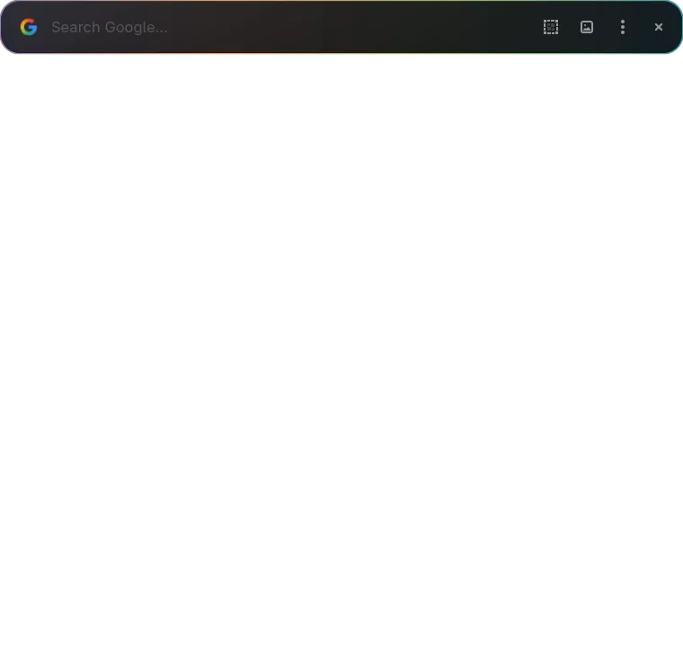

# Halo

**Google, one keypress away.**

A floating search popup for Fedora Workstation.

<i>✦ This passion project is heavily **AI-generated**.</i>

 

This is the main Halo window you are going to see:

 

Press Enter and it unfolds into Google:

 

 

## What it does

- Floats above every window when activated.
- Results open **inside** it, no need to launch your browser for a quick question.
- Nice theme.
- (Tells Google to deny the cookie popup).
- Goes away on Esc or keybind.

 

## Requirements

Halo is a GTK4 app, designed and tested specifically on **Fedora Workstation 44** (GNOME 50, Wayland). It might or might not work on other distributions. Nothing stops you from trying, and nothing should break if it doesn't work. (If I get enough requests I might try and add support for other distributions too)

Everything it needs is already preinstalled on stock Fedora Workstation:
- GTK 4, libadwaita, WebkitGTK 6
- PyGObject, Python 3

 

## Installation

1. Download **[halo.py](https://github.com/Choder7/Halo/raw/main/halo.py)**.
2. Move it to a location you plan on leaving it. (You can always move it to another location later, just repeat step 4 once and it will automatically repoint everything to the new location)
3. Right-click the "Halo.py" file, then choose *Properties*, and tick **Allow executing file as program**.
4. Right-click it again, and choose **Execute as Program**.
5. In the popup, click **⋮** and then **Set up Halo**.

After that Halo is automatically added to your app menu, starts it at login, and binds your custom keybind(s). It shows you every file it wants to create and waits for your yes. (You can configure it what it should create before proceeding)

To update to a newer version, simply drop the newer "halo.py" over the old one. (Or delete the old one and put in the new one.) No data will be lost.

 

## Keybinds

The full list can be opened within Halo, under **⋮** → **Manual & shortcuts**.

Essentials:
| | |
| --- | --- |
| **'Custom Keybind(s)'** | Open Halo |
| **Enter** | Search |
| **Ctrl + Enter** | Open current page or search in default browser |
| **Esc / 'Custom Keybind(s)'** | Hide |
| **Arrow up ↑** | Search history |
| **Double-press 'Custom Keybind(s)' / Arrow down ↓** | Reopen last page |
| **Ctrl + Shift + S** | Grab a region of the screen and search it with Lens |

You can also drop an image onto the Halo pill to Google-search it, or middle-click it to search whatever text is selected anywhere on screen.

 

## Where it lives

| | |
| --- | --- |
| Launcher | `~/.local/share/applications/` |
| Start at login | `~/.config/autostart/` |
| Settings | `~/.config/halo/config.json` |
| History, cookies, cache | `~/.local/share/halo/` |
| Shortcuts | ordinary GNOME custom shortcuts (can be viewed in settings)|

**⋮** → **Remove Halo's setup** → **Remove everything** if you want nothing left behind. Then delete the "halo.py" file.

 

## Story

I've got a so-called "Copilot Key" on my laptop's keyboard, which I was trying to find a viable use for for a long time. After the Google app for Windows came to mind, I found out that it does not support Linux whatsoever, which made me look for other options out there, but I couldn't find anything that would satisfy my needs. So I started building my own, mainly using AI. I've already been using Halo for a few months now, and now wanted to share it publicly for other people searching for the same as me.
Please leave some feedback for me to improve Halo upon.

 

## License

Copyright (C) 2026 Choder7

[GPL-3.0](LICENSE).

One added condition, under section 7(b): keep the attribution. Any copy or modified version you pass on has to name the author and link back to [this repository](https://github.com/Choder7/Halo). The notice at the top of "halo.py" is the one to preserve.
